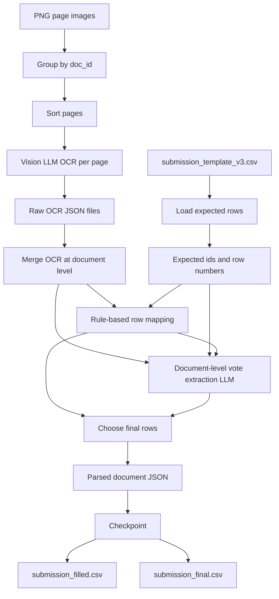

# Thai Election OCR Pipeline

<h3 align="center">OCR and vote-count extraction pipeline for scanned Thai election result documents</h3>

<p align="center">
  Practical notes, prompt patterns, and post-processing tricks for extracting structured vote counts from scanned Thai Form <strong>สส.6/1</strong> pages.
</p>

<p align="center">
  <strong>Normalized Levenshtein Distance: 0.1460</strong><br />
  <strong>Accuracy Proxy: 85.40%</strong><br />
  <sub>Calculated as 1 - normalized Levenshtein distance</sub>
</p>

---

## Overview

This project shares an OCR pipeline for extracting structured voting data from scanned Thai election result documents for the **2026 Thai general election**.

Given PNG scans of official election documents, the pipeline is designed to:

1. Group page images into election documents
2. Read each scanned page using a Vision LLM OCR prompt
3. Locate the correct voting-table row for each party or candidate entry
4. Extract the corresponding vote count
5. Normalize Thai numerals into Arabic digits `0-9`
6. Export a clean CSV containing only `id` and `votes`

The party names are already pre-filled in the reference template. The prediction target is the vote count for each `id`.

---

## Result

| Metric | Value | Interpretation |
| --- | ---: | --- |
| Normalized Levenshtein Distance | `0.1460` | Lower is better |
| Accuracy Proxy | `85.40%` | `1 - 0.1460` |

The accuracy value is a readable proxy derived from normalized Levenshtein distance. The original score is still reported because edit distance is the more precise metric for this OCR-style task.

---

## Data Snapshot

This pipeline was designed for a test-set-only OCR task on Thai election forms:

| Item | Count |
| --- | ---: |
| Documents | 300 |
| PNG page images | 846 |
| Submission rows | 10,053 |
| Public template | `submission_template_v3.csv` |

The final output only needs:

```text
id,votes
```

Extra metadata columns from the public reference files are useful for debugging and alignment, but the final output should be ordered by the template rows and keyed by `id`.

---

## Practical Tricks

- **Separate OCR from vote extraction**
  - First ask the Vision LLM to read each page into structured JSON.
  - Then run a document-level extraction pass using the merged OCR text and expected template rows.

- **Use JSON-only prompts**
  - The notebook asks the model to return a strict JSON object.
  - This makes downstream parsing much easier than parsing free-form OCR text.

- **Keep page-level raw outputs**
  - Every page OCR response is saved under `raw_outputs/`.
  - This makes debugging and rerunning only failed documents much faster.

- **Map by row number first**
  - Vote tables usually preserve row numbers more reliably than party names.
  - Party-name normalization is still useful as a fallback when row alignment is noisy.

- **Normalize numbers as the final gate**
  - Convert Thai digits to Arabic digits.
  - Remove commas, spaces, parentheses, and non-numeric text.
  - Make every final vote value digit-only before writing the CSV.

- **Checkpoint every document**
  - The run can be resumed after API errors, Colab disconnects, or rate limits.
  - Selected documents can be rerun without restarting the whole pipeline.

---

## Key Features

- **Document grouping**
  - Groups PNG pages by `doc_id`
  - Sorts multi-page documents by page number
  - Supports both constituency and party-list document patterns

- **Vision LLM OCR**
  - Sends each page image as base64 data URL
  - Uses JSON-only prompts for table OCR
  - Extracts row numbers, party names, candidate numbers, raw vote text, page type, and declared totals where available

- **Vote extraction refinement**
  - Runs a second LLM pass at document level
  - Uses merged OCR output, expected template rows, and rule-based matches
  - Produces normalized `id -> votes` predictions

- **Rule-based mapping**
  - Maps OCR rows by row number
  - Uses party-name normalization and alias correction
  - Falls back to vote extraction when rule-based output misses non-zero values

- **Thai number normalization**
  - Converts Thai digits `๐๑๒๓๔๕๖๗๘๙` to Arabic digits
  - Removes commas, parentheses, and non-numeric characters from vote counts
  - Ensures final vote values are digit-only strings

- **Checkpoint and resume**
  - Saves progress after each document
  - Allows rerunning selected documents
  - Avoids losing progress during long API runs

- **CSV export**
  - Writes a full filled template for debugging
  - Writes the final `id,votes` file

---

## Pipeline Workflow



---

## Notebook Structure

| Section | Purpose |
| --- | --- |
| 1. Imports | Load Python libraries for file handling, JSON, CSV, API calls, and data processing |
| 2. Configuration | Set API key, model names, input/output paths, retry settings, and output folders |
| 3. Normalization Helpers | Convert Thai digits, clean vote counts, normalize row numbers and party names |
| 4. Load Template and Group Documents | Load `submission_template_v3.csv` and group page images by document |
| 5. OpenRouter API Functions | Call Vision LLMs for OCR and document-level vote extraction |
| 6. Mapping / Validation Functions | Map OCR rows to template ids and choose final predictions |
| 7. Process Document and Run Pipeline | Run OCR, merge pages, extract votes, save checkpoint, and export submissions |
| Smoke Run | Run the pipeline on 3 documents for sanity checking |
| Full Run | Run all documents and generate final submission |

---

## Repository Structure

```text
.
|-- README.md
`-- OCR.ipynb
```

The images and template CSV are expected to live in Google Drive, not inside this repository.

---

## Expected Data Layout

The notebook uses the following default paths:

```python
INPUT_DIR = Path("/content/drive/MyDrive/SuperAI_SS6/Hackathon_Week2/data/images")
TEMPLATE_CSV = Path("/content/drive/MyDrive/SuperAI_SS6/Hackathon_Week2/data/submission_template_v3.csv")
OUTPUT_DIR = Path("/content/drive/MyDrive/SuperAI_SS6/Hackathon_Week2/data")
```

Expected Drive structure:

```text
SuperAI_SS6/
`-- Hackathon_Week2/
    `-- data/
        |-- images/
        |   |-- constituency_..._page1.png
        |   |-- constituency_..._page2.png
        |   |-- party_list_..._page1.png
        |   `-- ...
        |-- submission_template_v3.csv
        |-- raw_outputs/
        |-- merged_ocr/
        |-- vote_extraction/
        |-- parsed_outputs/
        |-- validation/
        |-- checkpoint.json
        |-- submission_filled.csv
        `-- submission_final.csv
```

---

## Quick Start

### 1. Open the notebook in Google Colab

Open:

```text
OCR.ipynb
```

### 2. Mount Google Drive

The notebook uses:

```python
from google.colab import drive
drive.mount("/content/drive")
```

### 3. Install dependencies

The notebook installs:

```bash
pip install requests pandas
```

### 4. Add API key

Set your OpenRouter API key in the configuration cell:

```python
OPENROUTER_API_KEY = "your_api_key_here"
```

Do not commit real API keys to GitHub.

### 5. Check model configuration

The notebook is configured with:

```python
MODEL_OCR = "google/gemini-3-flash-preview"
MODEL_VOTE_EXTRACTION = "google/gemini-3.1-flash-lite-preview"
```

These models are called through:

```python
OPENROUTER_URL = "https://openrouter.ai/api/v1/chat/completions"
```

### 6. Run a smoke test

Run the 3-document smoke test first:

```python
checkpoint = run_pipeline(max_docs=3)
```

Use this to confirm that OCR, mapping, checkpointing, and CSV export are working before running all documents.

### 7. Run the full pipeline

```python
checkpoint = run_pipeline()
```

The final `id,votes` file will be written to:

```text
submission_final.csv
```

---

## Output Files

| Output | Description |
| --- | --- |
| `raw_outputs/*.json` | Raw OCR response for each page image |
| `merged_ocr/*.json` | Merged OCR rows for each document |
| `vote_extraction/*.json` | Document-level LLM vote extraction output |
| `parsed_outputs/*.json` | Final parsed rows per document |
| `checkpoint.json` | Resume state and processed document results |
| `submission_filled.csv` | Debug version that keeps the full template columns |
| `submission_final.csv` | Final format containing only `id,votes` |

Final CSV format:

```csv
id,votes
constituency_xxx_1,1234
constituency_xxx_2,567
party_list_xxx_1,890
```

---

## Core Implementation Details

### Document ID Parsing

Image filenames are grouped into documents by removing a page suffix such as:

```text
_page1
_page2
```

The notebook infers document type from `doc_id`:

| Prefix | Type |
| --- | --- |
| `constituency_` | Constituency document |
| `party_list_` | Party-list document |

### OCR Prompting

The OCR prompt asks the Vision LLM to return JSON only. Constituency documents may contain candidate numbers, party names, row numbers, and vote counts, while party-list documents focus on party rows and vote counts.

Expected OCR row shape:

```json
{
  "row_num": "หมายเลข",
  "candidate_no": "หมายเลขถ้าเห็น",
  "party_name": "ชื่อพรรคถ้าเห็น",
  "vote_raw": "คะแนนถ้าเห็น"
}
```

### Vote Normalization

All predicted vote counts are normalized into digit-only Arabic numerals:

```text
๑,๒๓๔ คะแนน -> 1234
1,234 -> 1234
(1,234) -> 0 or cleaned numeric text depending on context
```

### Final Row Selection

The final result combines:

1. Rule-based mapping from OCR rows
2. Document-level LLM vote extraction
3. Non-zero replacement logic when extraction recovers a missing value

This hybrid approach reduces failures from OCR table misalignment, broken party names, and difficult multi-page documents.

---

## Output Notes

- Export only `id,votes`.
- Keep row order aligned with the public template.
- Do not rely on party names as the output key.
- Convert every Thai numeral to Arabic digits.
- Avoid submitting commas, spaces, Thai text, or units in `votes`.
- Keep `checkpoint.json` so long runs can resume safely.
- Use the smoke test before running all 300 documents.
- Do not expose API keys in the notebook or repository.

---

## Tech Stack

| Layer | Tools |
| --- | --- |
| Runtime | Google Colab, Python |
| Data Processing | pandas, csv, pathlib, json |
| OCR / Vision | OpenRouter Vision LLM API |
| OCR Model | `google/gemini-3-flash-preview` |
| Vote Extraction Model | `google/gemini-3.1-flash-lite-preview` |
| Input Format | PNG scanned election documents |
| Output Format | CSV submission with `id,votes` |

---

## License

This project is licensed under the MIT License. See `LICENSE` for details.
